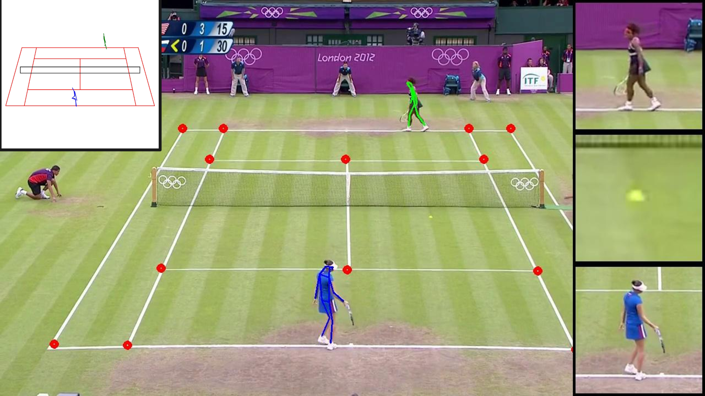

<div align="center">
    <h1 align="center">Predictive Pre-Training of Tennis Shot Embeddings</h1>
    
</div>

## Introduction

The goal of the project is to perform time series prediction of player poses and ball trajectory in tennis matches.
In order to limit computational complexity, a feature extraction pipeline will be built using open source models for object detection and pose estimation, to convert dense video into a sparse 3D representation of the point.
These extracted features will serve to build a time series prediction model based on graph neural networks and recursive neural networks.
The ability to predict the movement of players and ball in a tennis point is projected to unlock many downstream applications, from analytics to coaching.

The authors of this project are:

- Tawab Safi ([as7092](mailto:as7092@columbia.edu))
- George Tamer ([gyt2107](mailto:gyt2107@columbia.edu))
- Flor Sanders ([fps2116](mailto:fps2116@columbia.edu))

## Repository Structure

The repository is structured as follows.

- `src`: The source directory contains the project's implementation code, divided into four subparts: `data`, `model`, `train` and `eval`.
- `data`: This directory is where the data set should be stored, it can be downloaded from [Google Drive](https://drive.google.com/file/d/1HTamT51Mbb_vGaUXgQctgHYH3q80e_Wl/view?usp=sharing).
- `models`: Our pre-trained model weights are saved in this directory. Additionally, the model weights needed for pre-processing should be saved here.

Finally, the root directory of this repository also contains the project [slides](./slides.pdf) and [report](./report.pdf).

## Setup

Clone the repository to make a local copy and change directory.

```bash
git clone git@github.com:FlorSanders/adl_ai_tennis_coach.git
cd adl_ai_tennis_coach
```

The dependencies to run the code are included as an `environment.yml` file.  
They can be installed using conda by executing the following commands.

```bash
conda env create -f environment.yml
conda activate teco
```

Separate install instructions are required for the data pre-processing.  
These are provided in the README of the `src/data` directory.
