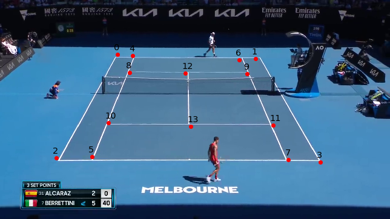
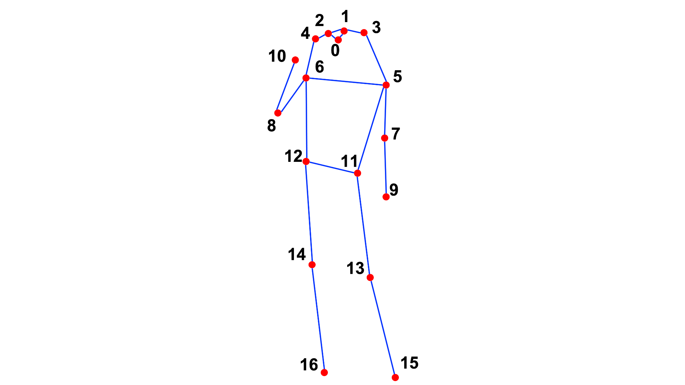
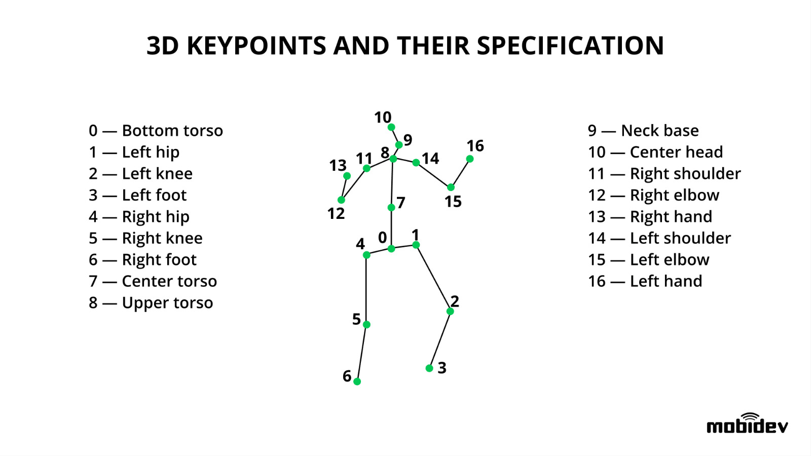

# Data Processing

The data processing pipeline is responsible for performing automated video annotation. The problem is broken down into subtasks discussed below.

Steps 1 to 3 are implemented as a chapter in the `1_data_processing_base.ipynb` notebook, with step 4 and 5 residing in `2_data_processing_3d.ipynb` and `3_data_split.ipynb`.
Furthermore, `data_utils.py` implements some tools for loading and visualizing the annotated data.

## Processing Steps

### Step 1 - Split tennis matches into point segments

The videos from the [Tenniset](https://github.com/HaydenFaulkner/Tennis) are segmented into shorter clips which contain point rallies.

The segments are saved in the `segments` sub-directory of the dataset directory.

#### Known issues

- For some videos, the annotation is not perfect as the resulting clips can start too early, at a moment when the court is not visible.

### Step 2 - Court, Players and Ball Detection

Starting from the segments created in step 1, we make use of the models in [Tennis Project](https://github.com/yastrebksv/TennisProject) to detect the below objects.

All the labels are saved in `.npy` format in the `labels` subdirectory of the dataset directory.

#### Court Keypoints

For each frame, 14 coordinates `(x, y)` are detected describing keypoints on the network. For reference, the order of the points is displayed in the image below.



This detection also serves as a filter for frame validity, namely that if this detection is invalid, we assume that the frame does not show the court at all. This is done to tackle the known issue from step 1.

The resuls are saved as:

- `{segment_id}_court.npy`: Contains a `frames` $\times$ `points` $\times$ `(x,y)` array for the valid frames.
- `{segment_id}_frame_validty.npy`: Contains an array of length `frames`, whose entries describe whether the frame is valid.

##### Known Issues

- The detected points are a bit jittery, some post-processing to improve their stability may be required.

#### Ball Position

A second network track the position `(x,y)` of the ball over time for the valid frames. The resulting array of coordinates is saved in `{segment_id}_ball.npy`.

##### Known issues

- Since the ball is a fast-moving object, its detection can be unreliable. In particular, there are many frames where the coordinates are either `[None, None]` or contain a completely wrong detection. One common error seems to be that the middle bottom point of the court is detected as the ball.
- Some serious post-processing will be required to recover the full trajectory of the ball. Maybe a second model should be used for good reconstruction.

#### Player Bounding Boxes

The bounding boxes of both players are detected for each valid frame in `(x_topleft, y_topleft, x_bottomright, y_bottomrigh)` format. These coordinates for both players are saved in:

- `{segment_id}_player_btm_bbox.npy`: Bottom player bounding box.
- `{segment_id}_player_top_bbox.npy`: Top player bounding box.

##### Known issues

- Sometimes, when detection of the actual player fails, the model detects another person on or near the field as the player.
- In other occasions no person is detected, in which case the coordinates are labeled `[None, None, None, None]`.

### Step 3 - Player 2D Pose Detection

To detect the player poses, we make use of the models available in [MMPose](https://mmpose.readthedocs.io/en/latest/overview.html).
Practically, we load in the court and bounding box predictions of each segment from step 2 and perform some heuristics-based pre-processing in order to improve its temporal consistency.

To extract the actual poses, we perform the following steps:

- Crop the frame to the detected bounding box of the player, with some added margin.
- Resize the cropped image to the size accepted by the MMPose model.
- Perform human pose detection using the MMPose model.
- Refer the detected pose coordinates back to the coordinate system of the original frame.

The pose detection returns new bounding boxes and a sequence of 17 coordinates `(x, y)` in the following order:

```
0 = nose
1, 2 = eyes
3, 4 = ears
5, 6 = shoulders
7, 8 = elbows
9, 10 = hands
11, 12 = hips
13, 14 = knees
15, 16 = feet
```

For reference, the following image visualizes the exact position of each detected point.



The results are saved as:

- `{segment_id}_player_btm_bbox_pose.npy`: New bottom player bounding box.
- `{segment_id}_player_btm_pose.npy`: Bottom player pose keypoints.
- `{segment_id}_player_top_bbox_pose.npy`: New top player bounding box.
- `{segment_id}_player_top_pose.npy`: Top player pose keypoints.

For downstream tasks, the new bounding boxes should be used rather than the originally detected ones.

#### Known issues

- The known issues for the original bounding boxes are still valid, though less severe thanks to the pre-processing applied.

### Step 4 - Player 3D Pose Detection

For 3D pose detection, we likewise make ise of the models available in [MMPose](https://mmpose.readthedocs.io/en/latest/overview.html).  
The pose detection returns a sequence of 17 coordinates `(x,y,z)` as shown below.



#### Known issues

- Unfortunately, the orientation of the detected poses is not consistently upright and furthermore seems inconsistent between frames. To (partially) resolve this, we match key points between the 2D and 3D pose detections and derive the [best fitting rotation matrix](https://nghiaho.com/?page_id=671) between them.
- The detected center hip joint, connecting both legs, is detected at a weird point for all 3D poses.
- Due to the limited number of pixels available for detection, the overall quality of the 3D poses is not very consistent.

### Step 5 - Train/Validation/Test Splitting

In order to avoid data leakage between the training and testing data, we isolate all segments of `V010` to the test set.  
The training and validation sets are made by performing a 80% train/20% validation split of the segments in the remaining videos.

## Setup

This repository contains submodules, which are required for processing of the dataset.  
In order to initialize them, run from the main repo directory:

```bash
git submodule init
git submodule update
```

Next, initiate a conda environment from the `environment.yml` file.

```bash
cd ./src/data
conda env create -f environment.yml
conda activate teco
```

If you have a CUDA device available on your system, you may want to install [Tensorflow](https://www.tensorflow.org/install/pip) and [Pytorch](https://pytorch.org/get-started/locally/) again with CUDA enabled.

If changes are made, the environment can be exported using the provided script.

```bash
bash export-environment.sh
```

### Modules

For the data processing steps, we make use of pre-trained models wherever possible. The inference code for these models are included as submodules in this repository.

However, as these original projects were developed with different goals in mind and over a wide timespan, care must be taken when trying to run them together.

#### [Tenniset](https://github.com/HaydenFaulkner/Tennis)

The source of our main dataset. The code in this repository is not used as the processing tasks are different for the project.

#### [Tennis Project](https://github.com/yastrebksv/TennisProject)

While alternatives like [Tennis Tracking](https://github.com/ArtLabss/tennis-tracking) offers the same functionality, they makes use of classical machine learning techniques that are quite compute intensive and cannot be parallellized on GPU.

This project offers a more modern Pytorch-based model for the tracking.  
The code can be run with the `teco` environment used for this project.

##### Bug fixes

- [homography.py](./tennis-project/homography.py): `tans_kps[i]` needs to be wrapped in `np.unsqueeze()` for the code to work.
- [postprocess.py](./tennis-project/postprocess.py): In the function `line_intersection(line1, line2)`, the if-statement needs to be extended with `and not isinstance(intersection[0], Line)`.

#### [MMPose](https://mmpose.readthedocs.io/en/latest/overview.html)

MMPose is an open-source toolkit for pose estimation tasks. We use it as a straight-forward interface to perform inference for pose detection on our tennis players.

The installation of this module makes use of their own package manager called MIM. Install the required components by running the following commands:

```bash
pip install openmim
mim install mmengine
mim install "mmcv>=2.0.1"
mim install "mmdet>=3.1.0"
mim install "mmpose>=1.1.0"
```
